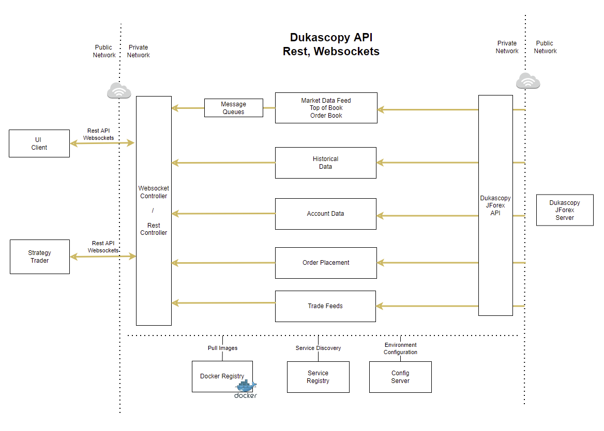

# dukascopy-api-websocket





**dukas-api** is a standalone server application for providing REST/WebSocket access to [Dukascopy][dukascopy-home]'s JForex trading platform.

The official [JForex SDK][dukascopy-wiki] allows the user to use JForex API by programming custom Java applications.

**dukas-api** server leverages this official SDK and provides REST/WebSocket access for the SDK.

* REST interface for simple request/response communication.
* Websocket interface for real-time top of book, and full order book feed
* Automatic connection management with JForex platform. (cf: connect, throttled-reconnect, instrument subscription, ...)
* Top of book data feed
* Order book (10 levels) data feed
* Account feed
* Candle data feed
* Restful requests for instrument data, account data, candle data, order book data, top of book data
* Pure Java application, requiring no additional installations other than the Java Runtime Environment.
* Spring Boot framework
* Jetty native Websocket api
* Placing of orders to JForex (not implemented yet)

**dukas-api-websocket** project was inspired by **[dukas-proxy](https://github.com/after-the-sunrise/dukas-proxy)** project that uses Websocket Stomp.


## Technology Stack
- Maven project; uses central maven repository; as well as Dukascopy maven repository
- Spring Boot
- Rest API
- Websockets
- Jackson Json serialization/deserialization
- In-memory queues
- Multi-threading environment
- Fault recovery
- Docker
- Kubernetes

## Getting Started

### Account

You can use either a demo account or a real account to connect.

You will need the username and password in order to connect to Dukascopy servers.


### Installation

Download the ZIP archive from [releases][github-releases] page, and unarchive into an arbitrary directory on the server.

### Configuration

Standard Spring Boot application.properties file

You can configure various properties:

- Dukascopy server (demo or real)
- `username` (demo or real)
- `password` (demo or real)

- Websocket port number
- Instrument list to pre-subscribe to.


Due to a limitation in spring boot framework with running native websockets (instead of websocket stomp/sockjs);
the application will be running on two ports:
- 7080 runs RestAPI (using spring boot rest controller)
- 7081 runs standard Websocket API (using Jetty native websocket)


### RestAPI

To get historical bar data:
* GET `http://localhost:7080/histdata?instID=EURUSD&period=60&timeFrom=0&timeTo=0`

```json
[
    {
        "symbol": "EURUSD",
        "open": 1.05137,
        "high": 1.05137,
        "low": 1.05137,
        "close": 1.05137,
        "volume": 0.0,
        "ticks": 0,
        "time": 1655003040000,
        "period": 60
    },
    {
        "symbol": "EURUSD",
        "open": 1.05137,
        "high": 1.05137,
        "low": 1.05137,
        "close": 1.05137,
        "volume": 0.0,
        "ticks": 0,
        "time": 1655003100000,
        "period": 60
    },
    ...
]
```

### WebSocket

WebSocket streaming interface can be accessed via standard websocket client

You can either subscribe to topOfBook; or to the full order book:


To subscribe to Top of Book with the configured list of instruments:
* CONNECT : `ws://localhost:7081/ticker?topOfBook=true`

To subscribe to Top of Book; with custom list of instruments
* CONNECT : `ws://localhost:7081/ticker?topOfBook=true&instIDs=EURUSD,EURJPY,USDJPY,AUDUSD`

To subscribe to Order Book (10 levels) with the configured list of instruments:
* CONNECT : `ws://localhost:7081/ticker?topOfBook=false`

To subscribe to Order Book; with custom list of instruments
* CONNECT : `ws://localhost:7081/ticker?topOfBook=false&instIDs=EURUSD,EURJPY,USDJPY,AUDUSD`


Top Of Book Payload is a JSON object (`application/json`)  
 
```json
{
    "symbol": "USD/JPY",
    "bidQty": 1.32,
    "bid": 133.176,
    "ask": 133.185,
    "askQty": 1.2,
    "last": 133.1805,
    "spread": 0.009000000000014552,
    "spreadBps": 0.6757517738494989,
    "updateTime": 1655429612056,
    "updateNumber": 0,
    "depthLevels": 10,
    "live": true
}
```


Order Book Payload is a JSON object (`application/json`)  
 
```json
{
    "symbol": "USD/JPY",
    "bidQty": 1.44,
    "bid": 133.307,
    "ask": 133.318,
    "askQty": 1.12,
    "last": 133.3125,
    "spread": 0.011000000000024102,
    "spreadBps": 0.8250948859136876,
    "updateTime": 1655430074627,
    "updateNumber": 0,
    "depthLevels": 10,
    "live": true,
    "bids": [
        {
            "quantity": 1.44,
            "price": 133.307
        },
        {
            "quantity": 3.75,
            "price": 133.304
        },
        {
            "quantity": 4.12,
            "price": 133.301
        },
        {
            "quantity": 1.8,
            "price": 133.299
        },
        {
            "quantity": 1.35,
            "price": 133.298
        },
        {
            "quantity": 1.8,
            "price": 133.296
        },
        {
            "quantity": 1.35,
            "price": 133.291
        },
        {
            "quantity": 3.6,
            "price": 133.29
        },
        {
            "quantity": 0.45,
            "price": 133.285
        },
        {
            "quantity": 8.95,
            "price": 133.262
        }
    ],
    "asks": [
        {
            "quantity": 1.12,
            "price": 133.318
        },
        {
            "quantity": 1.12,
            "price": 133.319
        },
        {
            "quantity": 4.57,
            "price": 133.32
        },
        {
            "quantity": 3.6,
            "price": 133.321
        },
        {
            "quantity": 4.05,
            "price": 133.322
        },
        {
            "quantity": 1.35,
            "price": 133.324
        },
        {
            "quantity": 4.05,
            "price": 133.331
        },
        {
            "quantity": 0.45,
            "price": 133.335
        },
        {
            "quantity": 1.8,
            "price": 133.358
        },
        {
            "quantity": 9.77,
            "price": 133.366
        }
    ]
}
```


To unsubscribe; just close the connection.


## Building from Source

JDK 11 or later is required. Make sure the `JAVA_HOME` environment variable is configured.

Then Clone the repository, and use maven build to build the archives.

```shell script
$JAVA_HOME/bin/java -version

git clone git@github.com:ismailfer/dukas-api-websocket.git

cd dukas-api-websocket 

mvn clean package

```

## Deployment to Docker / Kubenetes

This application have been dockerized (see Dockerfile).

Docker image:

[]()

To download docker image:

```shell script

docker pull ismailfer/dukascopy-api:latest

```

To run docker image:

```shell script

docker run --name dukascopy-api -d -p 7080:7080 -p 7081:7081 ismailfer/dukascopy-api:latest

```

If you want to build a docker image; make sure to update the correct Dukascopy server URL, username and password.

Alternatively you can edit Dockerfile and update the application parameters.

To build a docker image:

```shell script

docker build --tag dukascopy-api:1.0 .

```


