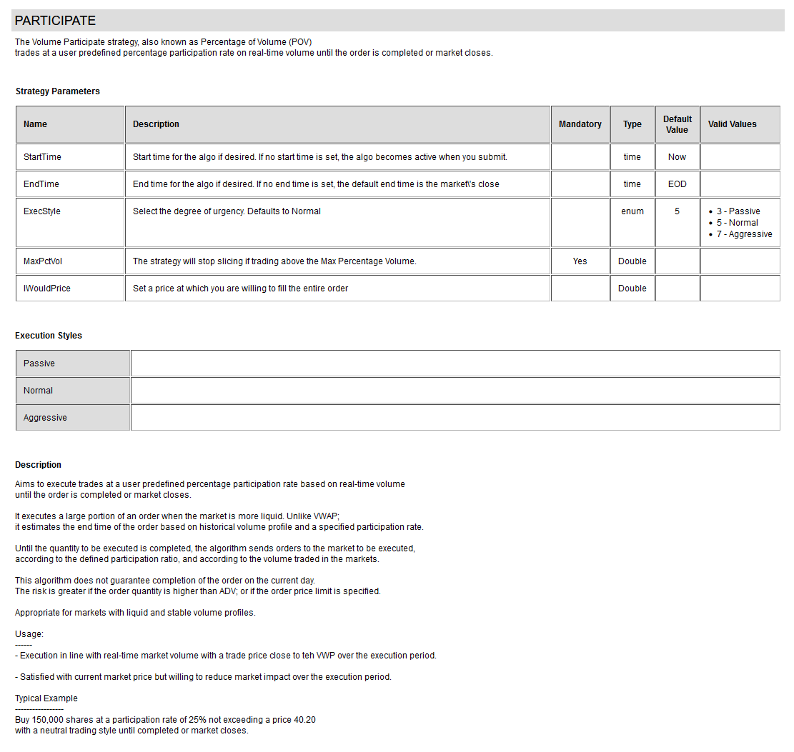

# PARTICIPATE Strategy

Inline Volume Participation strategy, also known as Percentage of Volume (POV).
Trades at a user predefined percentage participation rate on real-time volume until the order is completed or market closes. 

#### Strategy Detail

##### Note
To view up-to-date information about this strategy; and other strategies; visit this website:

[http://liquidalpha.mywire.org:8080/algos.jsp](http://liquidalpha.mywire.org:8080/algos.jsp)

