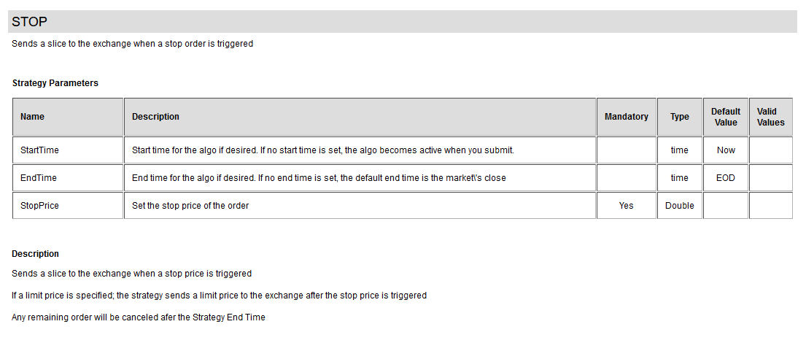

# STOP Strategy

Stop / StopLimit. Sends a slice to the exchange when a stop order is triggered 

#### Strategy Detail

##### Note
To view up-to-date information about this strategy; and other strategies; visit this website:

[http://liquidalpha.mywire.org:8080/algos.jsp](http://liquidalpha.mywire.org:8080/algos.jsp)

